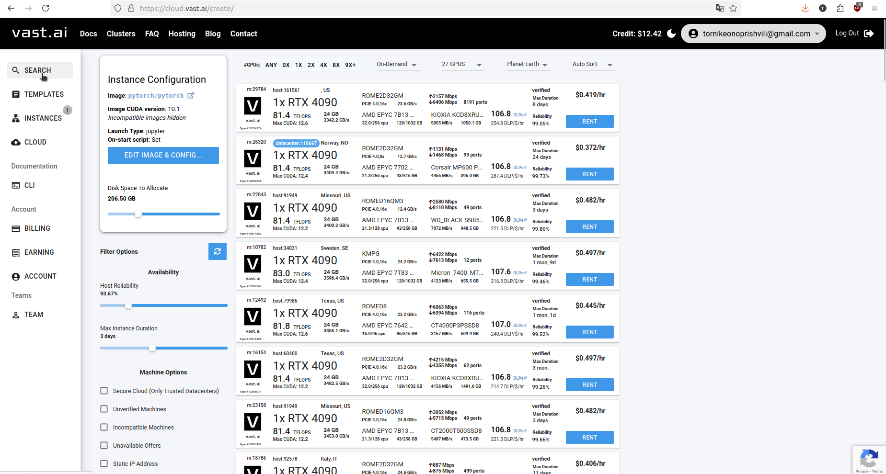
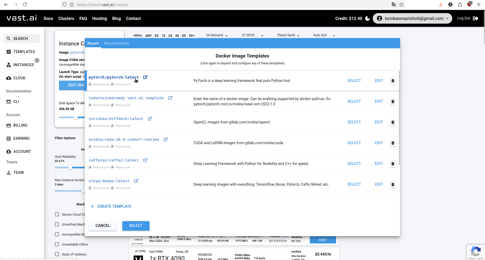
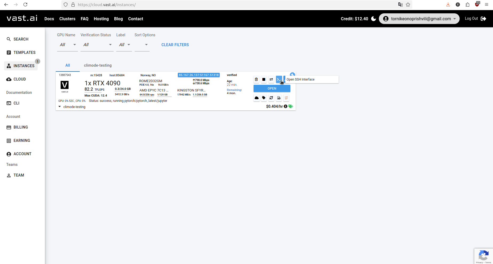

# Start an RTX4090 instance on vast.ai

1. Sign up for vast.ai, and use credit card to buy credits ($10 will be enough)
1. Search for an europe-based instance with 256 GB of Disk space, with 1x RTX4090, using search bar in vast.ai (eu, because lower latency)



1. "Edit Image" -> Select pytorch:latest docker image. 



# SSH into the instance

1. First, grab the ssh connection info:



1. Paste it into terminal, and say "yes". Check you have "nvidia-smi" available. This means GPU is online.

1. Open VSCode, and install "remote development extension pack", from extensions.

1. Press ctrl+p, and type "add new ssh host", and paste in the full "ssh connection info", like "ssh -p 51167 root@85.167.26.137 -L 8080:localhost:8080"

1. Connect.

# install

1. Clone repo with 
```sh
git clone https://github.com/tornikeo/climode-reproducibility.git --recursive
```

1. Run pip install -r requirements.txt
1. You will need to have a command `unzip` available, so install it by running scripts `commands.sh`

# download ERA5

1. run `python scripts/download.py` this will make `era5_data` directory and download your data. Downloaded files will look like this:

```
$ tree era5_data

era5_data/
├── 10m_u_component_of_wind
│   └── 10m_u_component_of_wind
├── 10m_v_component_of_wind
│   └── 10m_v_component_of_wind
├── 2m_temperature
│   └── 2m_temperature
├── constants
│   └── constants
├── geopotential_500
│   └── geopotential_500
└── temperature_850
    └── temperature_850
6 directories, 6 files
```
Each of 6 files is a zipfile here, actually. We need to extract each.

1. run `python scripts/upzip.py` This will both extract files and move them to `climode/ClimODE`
1. Check that all files are under . You must have a lot of .nc files in each directory.

```
$ tree -du -h data/
[root      182]  data/
├── [root     4.0K]  10m_u_component_of_wind
│   └── [root       58]  10m_u_component_of_wind
├── [root     4.0K]  10m_v_component_of_wind
│   └── [root       58]  10m_v_component_of_wind
├── [root     4.0K]  2m_temperature
│   └── [root       49]  2m_temperature
├── [root       31]  constants
│   └── [root       43]  constants
├── [root     4.0K]  geopotential_500
│   └── [root       51]  geopotential_500
└── [root     4.0K]  temperature_850
    └── [root       50]  temperature_850
```

**NOTE** `climode/ClimODE/era5_data` directory will now be 26GB total at this point.

# Install climode-specific requirements

1. First, install pyg, using `conda install pytorch-cluster -c pyg -y`
1. Then, run `pip install -r requirements.txt` to install the rest of the packages.
1. Run `conda install -c conda-forge xarray dask netCDF4 bottleneck -y` which will install `xarray` package and data I/O libraries.

All of above will take a 30 mins or so, so be patient. This is tested on the following vast.ai template:
"https://cloud.vast.ai/templates/edit?templateHashId=4a5b7f1e0aba3527f1f75cfb3bfc75b5"

Locally, you could also use either a:

`docker pull pytorch/pytorch:2.2.1-cuda12.1-cudnn8-devel` docker image (9GB)

or 

`docker pull pytorch/pytorch:2.2.1-cuda12.1-cudnn8-runtime` docker image (3.5GB), but lacks build tools.

# Run and fix

1. Run eval first. Make sure to be in `~/climode-reproducibility/climode/ClimODE$` directory
1. Run `python evaluation_global.py --spectral 0 --scale 0 --batch_size 8` and 
    You will get a `FileNotFoundError: [Errno 2] No such file or directory: b'/root/climode-reproducibility/climode/ClimODE/era5_data/constants/constants_5.625deg.nc'` error. 
1. Fix this by moving the constants file above:
    `cp era5_data/constants/constants/constants_5.625deg.nc era5_data/constants/`

1. Re-run that darn script.

1. You WILL get another error of `FileNotFoundError: [Errno 2] No such file or directory: '### Test velocity here'`. Stop at this point, and restart.

# Run once more
1. To run eval, you need several files that are missing. You need these files:

```
kernel.npy  test_10year_2day_mm_vel.npy  train_10year_2day_mm_vel.npy  val_10year_2day_mm_vel.npy
```

These will be generated as an intermediate step during running 

```sh
python train_global.py --scale 0 --batch_size 6 --spectral 0 --solver "euler" 
```

Notice batch size 6, as this is what fits on 24GB VRAM.

First you gotta run that, and it will generate the `*.npy` files.

Generating those npy files will take 20 mins or so.

The `train_global.py` will actually fail at this point, due indexing error during training. So we skip to eval immediately.

We will run 

```sh
python evaluation_global.py --spectral 0 --scale 0 --batch_size 8
```

We can afford the batch size 8, because we don't keep track of optimizer or activations for backprop (since it's an eval only).

This finishes in 4mins and we get a printout of performance and an index error. Performance printout looks like this:

```js
Lead Time  6 hours  | Observable  z | Mean RMSD  102.59124876855905 | Std RMSD  9.627892412514296
Lead Time  6 hours  | Observable  z | Mean ACC  0.994794203856553 | Std ACC  0.0016697642841398352
Lead Time  6 hours  | Observable  z | Mean CRPS  0.0037138576 | Std CRPS  0.004195602
Lead Time  6 hours  | Observable  t | Mean RMSD  1.1098526718863329 | Std RMSD  0.05327166680462279
Lead Time  6 hours  | Observable  t | Mean ACC  0.9746827896589796 | Std ACC  0.011035981732686575
Lead Time  6 hours  | Observable  t | Mean CRPS  0.0062865284 | Std CRPS  0.006702162
Lead Time  6 hours  | Observable  t2m | Mean RMSD  1.2347474107951777 | Std RMSD  0.07161291675291395
Lead Time  6 hours  | Observable  t2m | Mean ACC  0.9697300623126427 | Std ACC  0.0183545014947712
Lead Time  6 hours  | Observable  t2m | Mean CRPS  0.004506393 | Std CRPS  0.005683087
Lead Time  6 hours  | Observable  u10 | Mean RMSD  1.646669637542929 | Std RMSD  0.08490897210079595
Lead Time  6 hours  | Observable  u10 | Mean ACC  0.9177347324377485 | Std ACC  0.010467669586547414
Lead Time  6 hours  | Observable  u10 | Mean CRPS  0.012214332 | Std CRPS  0.013527819
Lead Time  6 hours  | Observable  v10 | Mean RMSD  1.6631527467269014 | Std RMSD  0.08587342001639521
Lead Time  6 hours  | Observable  v10 | Mean ACC  0.917430927577532 | Std ACC  0.009438958054353004
Lead Time  6 hours  | Observable  v10 | Mean CRPS  0.012981392 | Std CRPS  0.013883277
Lead Time  12 hours  | Observable  z | Mean RMSD  134.45439448391946 | Std RMSD  12.549453889957809
Lead Time  12 hours  | Observable  z | Mean ACC  0.9910779305109128 | Std ACC  0.0026888061328125077
Lead Time  12 hours  | Observable  z | Mean CRPS  0.0050886157 | Std CRPS  0.005568356
Lead Time  12 hours  | Observable  t | Mean RMSD  1.317550494915904 | Std RMSD  0.06492095896974764
Lead Time  12 hours  | Observable  t | Mean ACC  0.9638747759166014 | Std ACC  0.015595839538408792
Lead Time  12 hours  | Observable  t | Mean CRPS  0.007861043 | Std CRPS  0.007938077
Lead Time  12 hours  | Observable  t2m | Mean RMSD  1.4545338375398142 | Std RMSD  0.10646255323098112
Lead Time  12 hours  | Observable  t2m | Mean ACC  0.9569610082062411 | Std ACC  0.02650716749483097
Lead Time  12 hours  | Observable  t2m | Mean CRPS  0.0056609674 | Std CRPS  0.006991534
Lead Time  12 hours  | Observable  u10 | Mean RMSD  1.8594934844068627 | Std RMSD  0.09084901077616898
Lead Time  12 hours  | Observable  u10 | Mean ACC  0.8916982478136181 | Std ACC  0.012442319162399941
Lead Time  12 hours  | Observable  u10 | Mean CRPS  0.014428003 | Std CRPS  0.015290745
Lead Time  12 hours  | Observable  v10 | Mean RMSD  1.893832520381036 | Std RMSD  0.0920073504890695
Lead Time  12 hours  | Observable  v10 | Mean ACC  0.8889984725677167 | Std ACC  0.011921374881113144
Lead Time  12 hours  | Observable  v10 | Mean CRPS  0.015497714 | Std CRPS  0.015711047
Lead Time  18 hours  | Observable  z | Mean RMSD  162.44802243850762 | Std RMSD  14.400403105250104
Lead Time  18 hours  | Observable  z | Mean ACC  0.9869430590740853 | Std ACC  0.003953106277556291
Lead Time  18 hours  | Observable  z | Mean CRPS  0.006211376 | Std CRPS  0.0068019773
Lead Time  18 hours  | Observable  t | Mean RMSD  1.3993255190814136 | Std RMSD  0.06747285825772975
Lead Time  18 hours  | Observable  t | Mean ACC  0.9593886019669624 | Std ACC  0.017344970890297035
Lead Time  18 hours  | Observable  t | Mean CRPS  0.008534969 | Std CRPS  0.0084396135
Lead Time  18 hours  | Observable  t2m | Mean RMSD  1.4351872047894871 | Std RMSD  0.09613212511875942
Lead Time  18 hours  | Observable  t2m | Mean ACC  0.9619920262160201 | Std ACC  0.020539279432744112
Lead Time  18 hours  | Observable  t2m | Mean CRPS  0.005929729 | Std CRPS  0.007192898
Lead Time  18 hours  | Observable  u10 | Mean RMSD  1.913676100891345 | Std RMSD  0.08452457383584039
Lead Time  18 hours  | Observable  u10 | Mean ACC  0.8872477420986203 | Std ACC  0.012201925483205646
Lead Time  18 hours  | Observable  u10 | Mean CRPS  0.015214742 | Std CRPS  0.015580019
Lead Time  18 hours  | Observable  v10 | Mean RMSD  1.9402635917106275 | Std RMSD  0.08589418845208444
Lead Time  18 hours  | Observable  v10 | Mean ACC  0.8849182336206992 | Std ACC  0.012582685449411522
Lead Time  18 hours  | Observable  v10 | Mean CRPS  0.016207457 | Std CRPS  0.016041903
Lead Time  24 hours  | Observable  z | Mean RMSD  193.99510442067148 | Std RMSD  16.502432629542405
Lead Time  24 hours  | Observable  z | Mean ACC  0.9812927387833156 | Std ACC  0.005815396170113415
Lead Time  24 hours  | Observable  z | Mean CRPS  0.007421837 | Std CRPS  0.008204071
Lead Time  24 hours  | Observable  t | Mean RMSD  1.5007410428905448 | Std RMSD  0.07142880336945306
Lead Time  24 hours  | Observable  t | Mean ACC  0.9541672189497546 | Std ACC  0.018938670662782684
Lead Time  24 hours  | Observable  t | Mean CRPS  0.009255753 | Std CRPS  0.009076391
Lead Time  24 hours  | Observable  t2m | Mean RMSD  1.4097455707849766 | Std RMSD  0.09838508479970774
Lead Time  24 hours  | Observable  t2m | Mean ACC  0.9650525559660279 | Std ACC  0.01851245159771613
Lead Time  24 hours  | Observable  t2m | Mean CRPS  0.006082417 | Std CRPS  0.0073554604
Lead Time  24 hours  | Observable  u10 | Mean RMSD  2.022288201667979 | Std RMSD  0.08896639312818345
Lead Time  24 hours  | Observable  u10 | Mean ACC  0.87186470874559 | Std ACC  0.013653583511882844
Lead Time  24 hours  | Observable  u10 | Mean CRPS  0.016259905 | Std CRPS  0.01642775
Lead Time  24 hours  | Observable  v10 | Mean RMSD  2.05084437317296 | Std RMSD  0.08947395346288795
Lead Time  24 hours  | Observable  v10 | Mean ACC  0.8689578824261005 | Std ACC  0.015020321321567961
Lead Time  24 hours  | Observable  v10 | Mean CRPS  0.017303534 | Std CRPS  0.017018596
Lead Time  30 hours  | Observable  z | Mean RMSD  225.8844188070072 | Std RMSD  19.3743858286457
Lead Time  30 hours  | Observable  z | Mean ACC  0.9745030223097368 | Std ACC  0.007984744010561217
Lead Time  30 hours  | Observable  z | Mean CRPS  0.008609075 | Std CRPS  0.0096254265
Lead Time  30 hours  | Observable  t | Mean RMSD  1.597787986276013 | Std RMSD  0.08113573566778357
Lead Time  30 hours  | Observable  t | Mean ACC  0.9469902941119221 | Std ACC  0.022040556968800466
Lead Time  30 hours  | Observable  t | Mean CRPS  0.00986574 | Std CRPS  0.009647859
Lead Time  30 hours  | Observable  t2m | Mean RMSD  1.6376248058260257 | Std RMSD  0.11527794409595524
Lead Time  30 hours  | Observable  t2m | Mean ACC  0.9467375742266325 | Std ACC  0.03068139745164551
Lead Time  30 hours  | Observable  t2m | Mean CRPS  0.0068553253 | Std CRPS  0.0081993
Lead Time  30 hours  | Observable  u10 | Mean RMSD  2.1415704498613706 | Std RMSD  0.09734204128062879
Lead Time  30 hours  | Observable  u10 | Mean ACC  0.8548558085104556 | Std ACC  0.016147134082502252
Lead Time  30 hours  | Observable  u10 | Mean CRPS  0.017269485 | Std CRPS  0.017444635
Lead Time  30 hours  | Observable  v10 | Mean RMSD  2.1761236628782723 | Std RMSD  0.09743895407124373
Lead Time  30 hours  | Observable  v10 | Mean ACC  0.8524127620029222 | Std ACC  0.01726436923406826
Lead Time  30 hours  | Observable  v10 | Mean CRPS  0.018383633 | Std CRPS  0.018254042
Lead Time  36 hours  | Observable  z | Mean RMSD  259.27285257336837 | Std RMSD  22.517780921794024
Lead Time  36 hours  | Observable  z | Mean ACC  0.966238578813491 | Std ACC  0.010859646802003969
Lead Time  36 hours  | Observable  z | Mean CRPS  0.009851004 | Std CRPS  0.011040061
Lead Time  36 hours  | Observable  t | Mean RMSD  1.7024663335915136 | Std RMSD  0.08704412160249952
Lead Time  36 hours  | Observable  t | Mean ACC  0.9393516741912324 | Std ACC  0.025657253924174995
Lead Time  36 hours  | Observable  t | Mean CRPS  0.010562387 | Std CRPS  0.010401502
Lead Time  36 hours  | Observable  t2m | Mean RMSD  1.7062810807841537 | Std RMSD  0.15603559373803177
Lead Time  36 hours  | Observable  t2m | Mean ACC  0.9408485326964853 | Std ACC  0.035761490874240257
Lead Time  36 hours  | Observable  t2m | Mean CRPS  0.0072476314 | Std CRPS  0.0087406235
Lead Time  36 hours  | Observable  u10 | Mean RMSD  2.258108964625447 | Std RMSD  0.10608912470015783
Lead Time  36 hours  | Observable  u10 | Mean ACC  0.8360915892343416 | Std ACC  0.019825843077967833
Lead Time  36 hours  | Observable  u10 | Mean CRPS  0.018224064 | Std CRPS  0.018578613
Lead Time  36 hours  | Observable  v10 | Mean RMSD  2.299222816286587 | Std RMSD  0.10516392788311353
Lead Time  36 hours  | Observable  v10 | Mean ACC  0.8311779317547293 | Std ACC  0.019779859684434
Lead Time  36 hours  | Observable  v10 | Mean CRPS  0.01947564 | Std CRPS  0.019559098
Lead Time  42 hours  | Observable  z | Mean RMSD  290.4208481655213 | Std RMSD  25.821514195993696
Lead Time  42 hours  | Observable  z | Mean ACC  0.9574508097050192 | Std ACC  0.013806724854807951
Lead Time  42 hours  | Observable  z | Mean CRPS  0.010947104 | Std CRPS  0.012364051
Lead Time  42 hours  | Observable  t | Mean RMSD  1.7960272708611418 | Std RMSD  0.09695335370767318
Lead Time  42 hours  | Observable  t | Mean ACC  0.9325353977646778 | Std ACC  0.02862937754733996
Lead Time  42 hours  | Observable  t | Mean CRPS  0.011147273 | Std CRPS  0.011013411
Lead Time  42 hours  | Observable  t2m | Mean RMSD  1.7256197415485568 | Std RMSD  0.13572793533576344
Lead Time  42 hours  | Observable  t2m | Mean ACC  0.9447292809832352 | Std ACC  0.0304761997109315
Lead Time  42 hours  | Observable  t2m | Mean CRPS  0.0075075836 | Std CRPS  0.008943901
Lead Time  42 hours  | Observable  u10 | Mean RMSD  2.404191370596084 | Std RMSD  0.11333406353879422
Lead Time  42 hours  | Observable  u10 | Mean ACC  0.815954473383743 | Std ACC  0.022126315951042405
Lead Time  42 hours  | Observable  u10 | Mean CRPS  0.019393098 | Std CRPS  0.019795898
Lead Time  42 hours  | Observable  v10 | Mean RMSD  2.442480694675287 | Std RMSD  0.1167890260177222
Lead Time  42 hours  | Observable  v10 | Mean ACC  0.8106068808851384 | Std ACC  0.02239225899041043
Lead Time  42 hours  | Observable  v10 | Mean CRPS  0.020680698 | Std CRPS  0.020855002
```